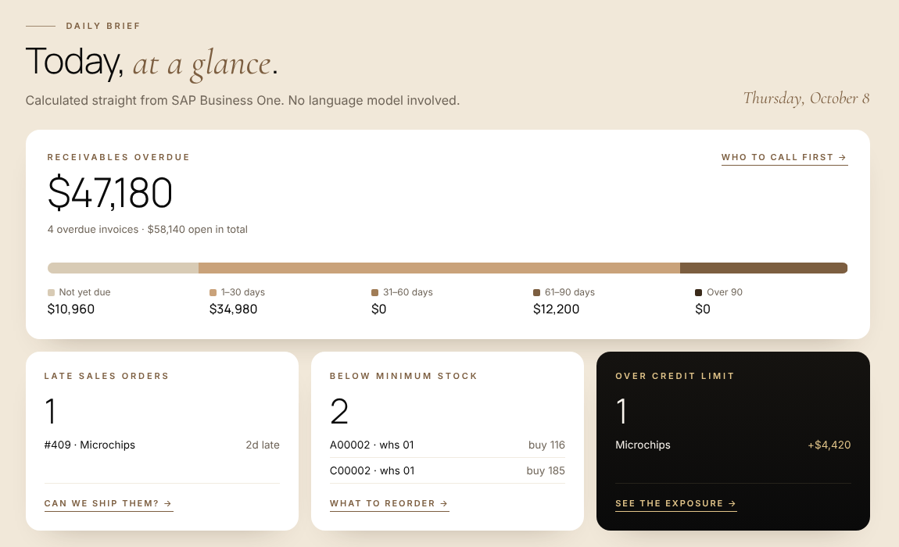
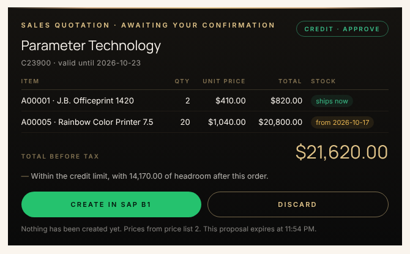
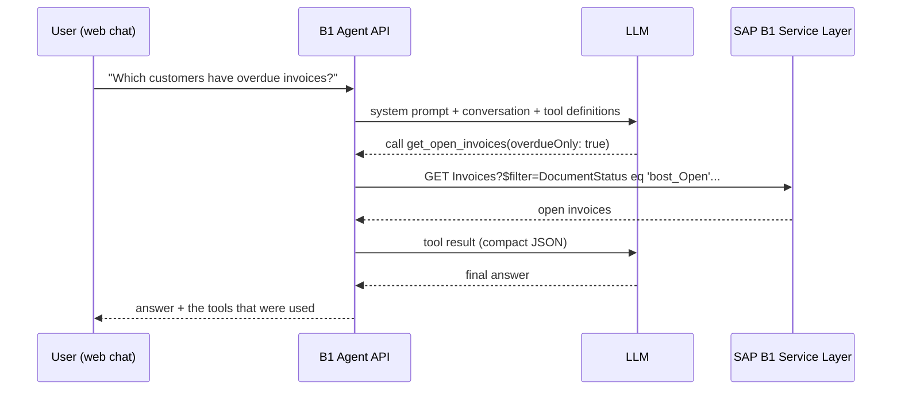

# B1 Agent

[](https://github.com/OWNER/b1-agent/actions/workflows/ci.yml)

A natural-language assistant for **SAP Business One**. Users ask in plain language
("Who should I call first about overdue invoices?", "When can we ship 15 units of A00003?",
"Quote 20 printers for Parameter Technology") and an LLM answers by calling tools over the **Service Layer**.
The arithmetic (aging, credit exposure, available-to-promise, reorder quantities) is done in tested C#,
so the model only explains finished numbers.

Built with .NET 10, ASP.NET Core and [Microsoft.Extensions.AI](https://learn.microsoft.com/dotnet/ai/microsoft-extensions-ai),
so the LLM provider is a configuration choice: OpenAI, Azure OpenAI, or a local model through Ollama.

It runs out of the box in **demo mode** with sample data, so no SAP installation is needed to try it.


## What it does for a B1 user

| Who | Question they ask today | What the agent does |
|---|---|---|
| Finance / collections | "Who do I call first?" | A/R aging per customer in 0-30 / 31-60 / 61-90 / 90+ buckets, largest overdue first |
| Sales rep | "Can I accept an $8,000 order from Norm Thompson?" | Credit check: balance + open orders + new order vs limit, plus overdue policy. **Approve / Review / Block** with reasons |
| Customer service | "When can we ship 15 of A00003?" | Available-to-promise: stock now, then open purchase order lines by expected date, until the quantity is covered |
| Purchasing | "What should I reorder this week?" | Items whose projected stock (in stock - committed + on order) is under the item's minimum, with a quantity up to the maximum |
| Sales rep | "What does Parameter Technology pay for A00005?" | Price from the customer's price list, falling back to the default list |
| Sales rep | "Quote 2 x A00001 and 20 x A00005 for Parameter Technology" | Prepares a sales quotation with prices, stock per line and the credit verdict. **It is only created in SAP when the user clicks Confirm** |
| Manager | (opens the page) | **Daily brief**: overdue receivables by age, late sales orders, items below minimum, customers over limit. No LLM needed |





## How it works



The tool-calling loop (model asks for a tool, the API runs it, the result goes back to the model)
is handled by `UseFunctionInvocation()` from Microsoft.Extensions.AI, capped at a configurable number of round trips.

### Tools

| Tool | What it answers |
|---|---|
| `search_business_partners` | Find customers, suppliers or leads by name or code |
| `get_business_partner` | Balance, credit limit, open orders, available credit, contacts |
| `search_items` | Find items by description or code |
| `get_item_stock` | Stock per warehouse: in stock, committed, ordered, available |
| `get_open_sales_orders` | Open sales orders, soonest due first |
| `get_open_invoices` | Open A/R invoices with unpaid balance and days overdue |
| `get_ar_aging` | Receivables per customer by age bucket |
| `check_credit_for_order` | Approve / Review / Block for a new order amount, with reasons |
| `check_item_availability` | Can it ship now, and if not, from which date (open purchase orders) |
| `get_late_sales_orders` | Open sales orders past their due date |
| `get_reorder_suggestions` | Items below minimum stock and how much to buy |
| `get_item_price` | Unit price from the customer's price list |
| `get_daily_brief` | The overview above, for "how are we doing today?" |
| `prepare_sales_quotation` | A quotation **proposal**. Creates nothing; the user confirms in the UI |

### Design decisions

- **Nothing is written without a person.** The model can only *prepare* a sales quotation. The proposal is stored
  server-side and shown as a card; it reaches SAP only through `POST /api/actions/{id}/confirm`, which no LLM tool can call.
  The write method lives on a separate interface (`ISapB1Writer`) that the tools never receive. Proposals expire,
  and a double click cannot create two quotations.
- **Code does the maths.** Aging, credit, available-to-promise and reorder rules are pure functions in
  `Insights/Calculations.cs`, unit-tested on their own. The model receives finished numbers and verdicts.
- **Business rules are configuration.** Overdue thresholds for Review/Block, default price list, quotation validity
  and proposal lifetime are in the `Policy` section of `appsettings.json`.
- **The model never writes queries.** Tools take plain values (a code, a search term); the client builds the
  OData URL and escapes every value, so user text cannot alter the filter. There is a test for exactly that.
- **Hard limits outside the model.** Row counts are capped in the client (`SapB1:MaxRows`), whatever the model asks for.
- **Compact tool results.** Tools return small records with only the fields the assistant needs,
  not raw Service Layer entities. Less noise for the model, fewer tokens, less data exposed.
- **Errors become answers.** If Service Layer fails, the tool returns a short message the model can relay,
  instead of an exception that ends the conversation.
- **Service Layer sessions.** One long-lived client keeps the `B1SESSION`/`ROUTEID` cookies, logs in once,
  and logs in again transparently when the session expires (HTTP 401). Concurrent requests share a single re-login.
- **Stateless API.** The browser keeps the conversation and sends it with each request, so the API can scale
  horizontally without session storage. Only `user` and `assistant` turns are accepted; the system prompt is server-side.
- **Vendor-neutral core.** `B1Agent.Core` depends only on the `IChatClient` abstraction. The LLM vendor is wired in one
  place (`LlmSetup.cs`).

## Quick start (demo data)

Requirements: .NET 10 SDK, and either an OpenAI API key or [Ollama](https://ollama.com) running locally.

```bash
git clone https://github.com/OWNER/b1-agent.git
cd b1-agent

# Option A: OpenAI
dotnet user-secrets set "Llm:ApiKey" "sk-..." --project src/B1Agent.Api

# Option B: local model with Ollama (free, no key)
ollama pull qwen2.5:7b
dotnet user-secrets set "Llm:Endpoint" "http://localhost:11434/v1" --project src/B1Agent.Api
dotnet user-secrets set "Llm:Model" "qwen2.5:7b" --project src/B1Agent.Api

dotnet run --project src/B1Agent.Api
```

Open http://localhost:5080 and try the example questions.

Or with Docker, demo data plus Ollama, no keys at all:

```bash
docker compose up -d
docker compose exec ollama ollama pull qwen2.5:7b
# open http://localhost:8080
```

The demo company is modelled on the SAP B1 US demo database (customers such as Norm Thompson and
Microchips, items A00001-A00005). Document dates are relative to today, so there are always current,
due-soon and overdue documents to ask about.

## Trying it against your own Service Layer (from the browser)

Click **Connect your Service Layer** in the agent console and enter the address, company database, user and password.
The server logs in, reads one business partner to prove access, and from then on everything on the page (chat,
daily brief, quotations) reads from that company, for that browser session only.

- Credentials live only in server memory, inside that session's Service Layer client. They are never stored, logged
  or returned to the page. The B1 session is logged out on disconnect or after `Connections:IdleMinutes` idle.
- **Read-only by default.** Quotations can be created only if "Allow creating sales quotations" was ticked, and still
  only after the user clicks Confirm on the proposal. A proposal is bound to the browser session and to the company
  it was priced against.
- **SSRF protection for public deployments.** Only `https` Service Layer roots are accepted; every outgoing socket
  is checked at connect time and private, loopback, link-local and CGNAT addresses are refused (set
  `Connections:AllowPrivateNetworks` to `true` only on a server inside your own network). Redirects are not followed.
- Chat and connection attempts are rate limited per visitor (`RateLimits` section).

## Connecting to a real SAP Business One (server default)

```bash
dotnet user-secrets set "SapB1:Mode" "ServiceLayer" --project src/B1Agent.Api
dotnet user-secrets set "SapB1:BaseUrl" "https://your-b1-server:50000/b1s/v1/" --project src/B1Agent.Api
dotnet user-secrets set "SapB1:CompanyDB" "SBODEMOUS" --project src/B1Agent.Api
dotnet user-secrets set "SapB1:UserName" "manager" --project src/B1Agent.Api
dotnet user-secrets set "SapB1:Password" "..." --project src/B1Agent.Api
# Only for test servers with the default self-signed certificate:
dotnet user-secrets set "SapB1:AllowUntrustedCertificate" "true" --project src/B1Agent.Api
```

Use a dedicated B1 user for the agent, authorized to read the master data and documents above and to create
sales quotations only. Works with SAP B1 on HANA and SQL Server (Service Layer v1). Incoming supply uses a Service
Layer `$crossjoin` on purchase order lines.

Calculations that need many rows (aging, reorder, daily brief) page through Service Layer up to `SapB1:MaxScanRows`
(2,000 by default). For companies with more open documents than that, back those methods with a SQL view or a
Service Layer SQL query instead.

## API

| Method | Path | Description |
|---|---|---|
| `POST` | `/api/chat` | `{ "messages": [{ "role": "user", "content": "..." }] }` → `{ "reply": "...", "toolCalls": [...] }` |
| `GET` | `/api/tools` | Tool names and descriptions sent to the model |
| `GET` | `/api/brief` | Daily brief (no LLM involved) |
| `GET` | `/api/actions/{id}` | A proposal and its status |
| `POST` | `/api/actions/{id}/confirm` | Creates the proposed quotation in SAP. Called by the user's click, never by the model |
| `POST` | `/api/actions/{id}/cancel` | Discards a proposal |
| `GET` | `/api/health` | Data source mode and LLM configuration |

## Project layout

```
src/
  B1Agent.Core/        SAP B1 access, tools and agent. No web or LLM-vendor dependencies.
    SapB1/             ISapB1Client, Service Layer client, OData helpers, mapping
    Demo/              In-memory sample company
    Insights/          Aging, credit, ATP, reorder, pricing, daily brief (pure calculations + loader)
    Actions/           Quotation proposals, confirmation store
    Agent/             Tools exposed to the LLM, system prompt, agent
  B1Agent.Api/         ASP.NET Core host, LLM wiring, web chat (wwwroot)
tests/
  B1Agent.Tests/       Service Layer client (fake HTTP), tools, agent loop (scripted LLM), API
```

## Tests

```bash
dotnet test
```

The tests need neither SAP nor an LLM: Service Layer is replaced by a scripted `HttpMessageHandler`
and the model by a scripted `IChatClient`, which lets the tests check the whole tool-calling loop,
including what the model receives back from each tool.

## Roadmap

- Sales orders from a confirmed quotation, with the same confirmation step
- Special prices and discount groups in pricing
- Collection e-mail drafts per customer from the aging report
- Streaming responses
- Authentication and per-user B1 authorizations; persistent proposal store (Redis/SQL) for multiple instances

## Author

Paulo Zadoque · .NET back-end developer, SAP Business One integrations
[LinkedIn](https://www.linkedin.com/in/paulo-zadoque)

Licensed under the MIT License.
