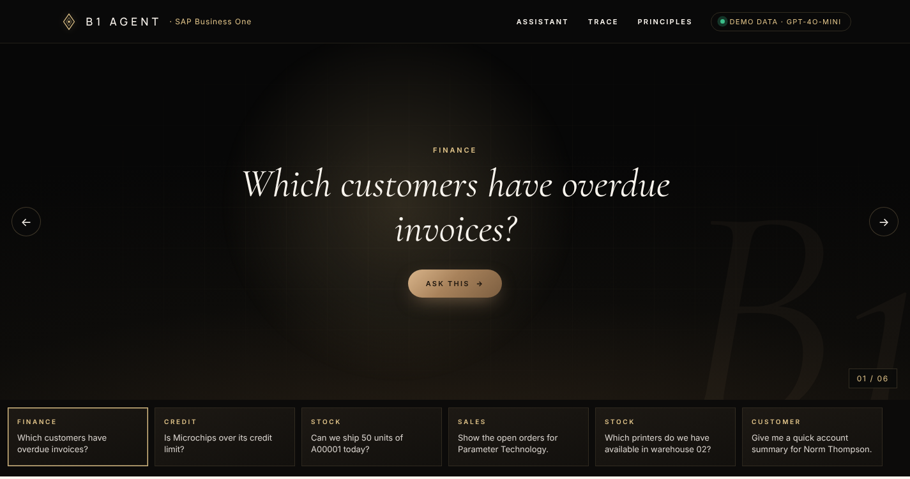
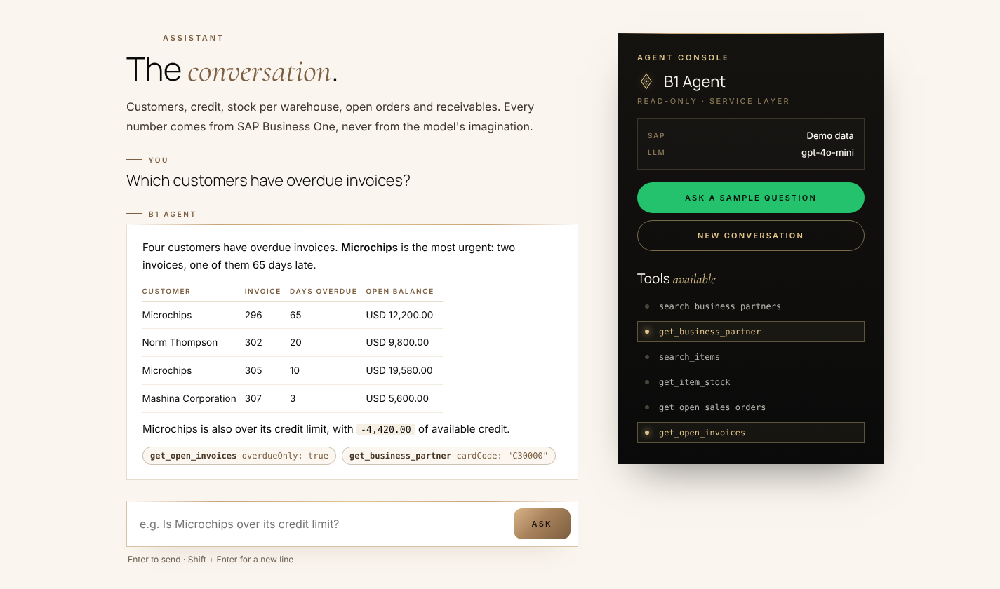
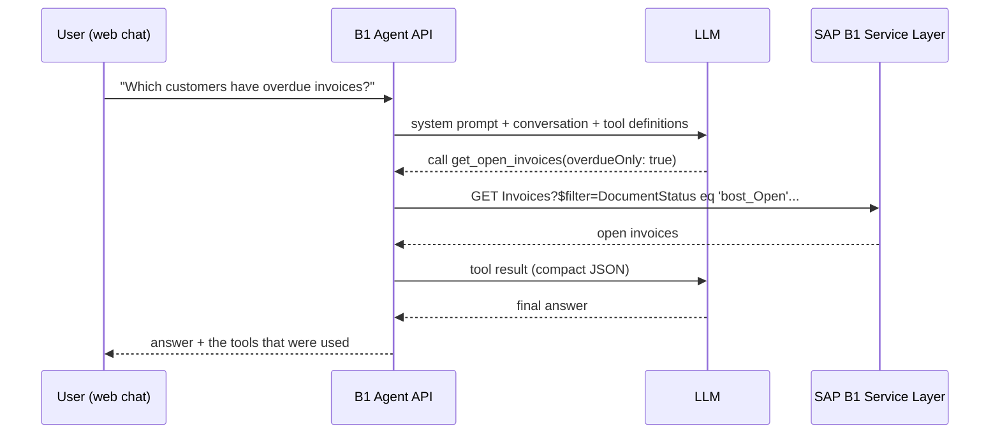

# B1 Agent

[](https://github.com/OWNER/b1-agent/actions/workflows/ci.yml)

A natural-language assistant for **SAP Business One**. Users ask questions in plain language
("Is Microchips over its credit limit?", "Can we ship 50 units of A00001 today?") and an LLM answers
by calling read-only tools that query the **Service Layer**.

Built with .NET 10, ASP.NET Core and [Microsoft.Extensions.AI](https://learn.microsoft.com/dotnet/ai/microsoft-extensions-ai),
so the LLM provider is a configuration choice: OpenAI, Azure OpenAI, or a local model through Ollama.

It runs out of the box in **demo mode** with sample data, so no SAP installation is needed to try it.





## How it works



The tool-calling loop (model asks for a tool, the API runs it, the result goes back to the model)
is handled by `UseFunctionInvocation()` from Microsoft.Extensions.AI, capped at a configurable number of round trips.

### Tools

| Tool | What it answers |
|---|---|
| `search_business_partners` | Find customers, suppliers or leads by name or code |
| `get_business_partner` | Balance, credit limit, open orders, available credit, contacts |
| `search_items` | Find items by description or code |
| `get_item_stock` | Stock per warehouse: in stock, committed, ordered, available |
| `get_open_sales_orders` | Open sales orders, soonest due first |
| `get_open_invoices` | Open A/R invoices with unpaid balance and days overdue |

### Design decisions

- **Read-only by design.** No tool creates or changes documents. Write actions (e.g. drafting a sales
  order) would need an explicit human confirmation step, which is on the roadmap.
- **The model never writes queries.** Tools take plain values (a code, a search term); the client builds the
  OData URL and escapes every value, so user text cannot alter the filter. There is a test for exactly that.
- **Hard limits outside the model.** Row counts are capped in the client (`SapB1:MaxRows`), whatever the model asks for.
- **Compact tool results.** Tools return small records with only the fields the assistant needs,
  not raw Service Layer entities. Less noise for the model, fewer tokens, less data exposed.
- **Errors become answers.** If Service Layer fails, the tool returns a short message the model can relay,
  instead of an exception that ends the conversation.
- **Service Layer sessions.** One long-lived client keeps the `B1SESSION`/`ROUTEID` cookies, logs in once,
  and logs in again transparently when the session expires (HTTP 401). Concurrent requests share a single re-login.
- **Stateless API.** The browser keeps the conversation and sends it with each request, so the API can scale
  horizontally without session storage. Only `user` and `assistant` turns are accepted; the system prompt is server-side.
- **Vendor-neutral core.** `B1Agent.Core` depends only on the `IChatClient` abstraction. The LLM vendor is wired in one
  place (`LlmSetup.cs`).

## Quick start (demo data)

Requirements: .NET 10 SDK, and either an OpenAI API key or [Ollama](https://ollama.com) running locally.

```bash
git clone https://github.com/OWNER/b1-agent.git
cd b1-agent

# Option A: OpenAI
dotnet user-secrets set "Llm:ApiKey" "sk-..." --project src/B1Agent.Api

# Option B: local model with Ollama (free, no key)
ollama pull qwen2.5:7b
dotnet user-secrets set "Llm:Endpoint" "http://localhost:11434/v1" --project src/B1Agent.Api
dotnet user-secrets set "Llm:Model" "qwen2.5:7b" --project src/B1Agent.Api

dotnet run --project src/B1Agent.Api
```

Open http://localhost:5080 and try the example questions.

Or with Docker, demo data plus Ollama, no keys at all:

```bash
docker compose up -d
docker compose exec ollama ollama pull qwen2.5:7b
# open http://localhost:8080
```

The demo company is modelled on the SAP B1 US demo database (customers such as Norm Thompson and
Microchips, items A00001-A00005). Document dates are relative to today, so there are always current,
due-soon and overdue documents to ask about.

## Connecting to a real SAP Business One

```bash
dotnet user-secrets set "SapB1:Mode" "ServiceLayer" --project src/B1Agent.Api
dotnet user-secrets set "SapB1:BaseUrl" "https://your-b1-server:50000/b1s/v1/" --project src/B1Agent.Api
dotnet user-secrets set "SapB1:CompanyDB" "SBODEMOUS" --project src/B1Agent.Api
dotnet user-secrets set "SapB1:UserName" "manager" --project src/B1Agent.Api
dotnet user-secrets set "SapB1:Password" "..." --project src/B1Agent.Api
# Only for test servers with the default self-signed certificate:
dotnet user-secrets set "SapB1:AllowUntrustedCertificate" "true" --project src/B1Agent.Api
```

Use a dedicated B1 user with read-only authorizations for the agent. Works with SAP B1 on HANA and SQL Server
(Service Layer v1).

## API

| Method | Path | Description |
|---|---|---|
| `POST` | `/api/chat` | `{ "messages": [{ "role": "user", "content": "..." }] }` → `{ "reply": "...", "toolCalls": [...] }` |
| `GET` | `/api/tools` | Tool names and descriptions sent to the model |
| `GET` | `/api/health` | Data source mode and LLM configuration |

## Project layout

```
src/
  B1Agent.Core/        SAP B1 access, tools and agent. No web or LLM-vendor dependencies.
    SapB1/             ISapB1Client, Service Layer client, OData helpers, mapping
    Demo/              In-memory sample company
    Agent/             Tools exposed to the LLM, system prompt, agent
  B1Agent.Api/         ASP.NET Core host, LLM wiring, web chat (wwwroot)
tests/
  B1Agent.Tests/       Service Layer client (fake HTTP), tools, agent loop (scripted LLM), API
```

## Tests

```bash
dotnet test
```

The tests need neither SAP nor an LLM: Service Layer is replaced by a scripted `HttpMessageHandler`
and the model by a scripted `IChatClient`, which lets the tests check the whole tool-calling loop,
including what the model receives back from each tool.

## Roadmap

- Write actions with human-in-the-loop confirmation (draft sales order, then "confirm" in the UI)
- Streaming responses
- Authentication and per-user B1 authorizations
- More tools: price lists, delivery status, purchase orders, item availability by date (ATP)

## Author

Paulo Zadoque · .NET back-end developer, SAP Business One integrations
[LinkedIn](https://www.linkedin.com/in/paulo-zadoque)

Licensed under the MIT License.
